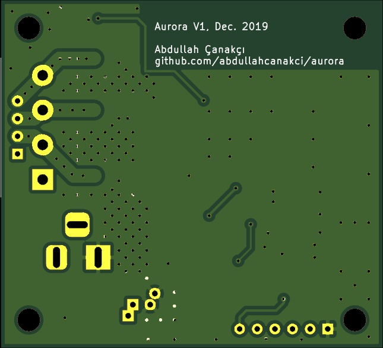

I have one of those led strips which controlled with a colorful remote and shows you the rainbow. I like them, setting the mood up so I can spend time on dark themed environments, or not having to get up after I'm done for the night and want some sleep.
But I think they lack some of those IOT and modern electronics magic we get used to. I only have cheap ones, not those philips hue or some other brand. 
The ones I have, has 20 preconfigured color and 4 different seizure inducing modes, can alter brightness. Everthing is fine and dandy. But if you want to have another color, too bad. Want to turn your home something other than a disco, no mode for that.

In my mind perfect control device should have:
1. Can alter colors without any limit.
2. Can alter modes without any limit.
3. Set auto on-off setting.
4. Can controlled from old school remotes.
5. Integration.

## 1 - Coloring

It just PWM how hard can it be. 

Right now I'm leaning into 3 color channels + 1 common channel. From my market search most of these strips are common VCC and RGB, there are some RGBW but not really widespread, at least in my country.

## 2 - Modes

The ones I have seen have

- Strobe
- Fade
- Ones above but with different colors.

I think these are not really nice modes, fade is somewhat bearable. Having ability to change fade colors, times and looping would be great, one can achieve so much with mere settings. 

## 3 - Auto

Automatic off would be nice set a timeout and let it fade out, or set a timer and wake up to fake sunset in the middle of winter.

## 4 - Remote

Although having a network connection is great we can't be certain a networked device would be avaible for, this reason there should be sane defaults, and ability to set any random IR remote as remote would be great. 

## 5 - Integration

I though about a bit about how can I implement multi device, controller etc in a system only composed of ESP12. It is not actually hard, but I didn't like the complexity of doing it all in C++, with some half-baked http library.

Thinking about Raspberry Pi Mini, an idea occurred, lets make a rPi a host, that applicable devices can connect, this way, I only need to create a web server to handle "User Interaction" on rPi, and it will pass down relevant data to controllers. This way I don't have to implement so much in ESP12's constraints. This has significant positives:

- Only need to create one web app to handle multi devices.
- Ease of adding and removing devices to system
  - Old way, I have to add a device to a network and set it up, and use it alone. This way, a newly added device can search the network for a compliant device and set up a connection and set the device up. After we can manage the controller device with the unified webapp.
- Ease of extensibility. 
  - Host system can be updated to handle more types of devices.
  - Host can be changed with a compliant system.
  - Host can implement third party home automation systems.
- Can update controller systems through air? Should be possible, have seen it, need to check how to implement it.

## Hardware

I have a look at some devices to use

- Raspberry Pi mini as host device. May create a hat for it to act as also, but not really sure about it.

- ESP12, is a good choice for sole pwm controlling job. It can do 200Hz refresh rate with 5ms downtime with software pwm. For hardware pwm, it has limited(2?) channels and not enough PWM counters to handle 3 different pwm channels.
- IRLML0030TRBF (TR Tape reel, BF ?), is a great little mosfet.
  - SOT23, so small
  - V_gth = 2.9V, which is great for most microcontrollers
  - Rds_on = 40mΩ @ 4.5V up to 4.2 amp continuos current. Which is plenty. Will mean ~50W @ 12V per channel. Prolly should limit it about 30W for 10 meter of 3W/m strip per channel.
  - PD of 0.65W @3.3V gate voltage 4 amp current, which will create a junction temperature of 65°C over ambient.
  - Not expensive @ 0.42$ per piece.
- Board will be 2 layers, preferably smaller than 40x60mm.

### Hardware Design

---

I have finally finished the hardware for led controller. It took some time, but I'm happy with the final product. While I was on the drawing board, I considered driving mosfets with pins from ESP12, which would work fine. But the specifications of the mosfet only provides values down to 4.5V which is 33mΩ. At 3.3V I was not in a safe spot to use the mosfet to it's limits. So I constructed a front end for every channel which consists of 1 PNP and 1 NPN transistor and few resistors. This enabled me to raise gate voltage of the mosfet to ~10.8V which Rdson = 22mΩ. Reduces resistance will achieve better thermals duty cycle is close to %100. Also by using transistors, mosfet gate charge time will be shorter which means mosfet will spend less time on the high resistance zones which also will help me to achieve better thermals. Cost for the extra transistors is negligible. They cost about 0.10$ to 0.15$ per 20 to 25 piece.

Final board size ended up at 50mm by 55mm which is great. While designing the board 40x60 was a bit optimistic but in the end it is only off by %15.

There is few things I will change before fabrication. Connectors are generic ones, silkscreens are off and I want them to have more information on them. Will change them with similar ones.

Power dissipation is fine at 10.8V gate voltage, 5.2A current. Resistive losses are @ 0.89W which will raise temperature to 90°C over ambient. Switching losses should be fine. By using transistors I reduced time to charge the gate capacitor. Also ESP12 will most likely run the PWM @ 1KHz which is pretty low, in this situation resistive losses will be the driving force. 

I used [this](https://www.electronicdesign.com/boards/calculate-dissipation-mosfets-high-power-supplies) website to help me with power dissipation.

