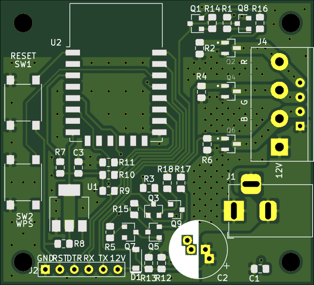

# Preface

I have one of those led strips with a colorful remote to control it. Most people have them, they are cheap, they are easy to install and most important of all abundant.

If I have to find a problem with them, it would be their horrendous controls. They have all the colors needed for full spectrum color creation, but their control circuitry only allows about 20 colors and 10 brightness settings.

I would like to have a controller with precise color control,  multiple modes to use and somewhat smart so it can act on predefined triggers.

Aim of the Aurora project is to create a led strip controller.

[Workspace Set-up](workspace.md)

## Requirements

1. High color range.
2. Multiple modes to use.
3. Actions by predefined triggers.
4. Integrated or solo use.
5. Preferably remote controlled.

### Led Control

Most of the generic led strips I have found contains RGB sink channels and 1 common VCC one. These are generally powered by 12V dedicated power supplies. There are some 4 color strips which includes white but they are not really common.

Each color channel will be controlled by a dedicated mosfet circuitry. These circuits will be driven by a micro controller in PWM achieve fine grained control.

#### Brightness

Controlling brightness of a led emitting diode is hard. On a led display a backlight is used to illuminate the colored substrate. If you want to control it's brightness you reduce the duty cycle of backlight to achieve different brightness levels. In light emitting diodes each color led is producing it's own light and reducing brightness by clamping duty cycle of  said led will create different color ranges on different brightness levels which can be observed on devices using OLED technology.

There are 2 different ways to tackle this problem. Making the brightness a logarithmic curve, so color range loss will be less visible is easier one but also the problem will still persist. Other one is, defining 3 color channels as 1 channel and controlling the duty cycle of this main channel. In the end we will achieve better color accuracy.

#### Coloring

Creating a color mix of 3 different light sources is easy with controlling duty cycle of each color channel.

### Modes

Lightning modes available on a commercial device at best is lacking. Strobe, fade, flash and few more. They are all uncomfortable. I don't really know if a good mode can be found to implement.

#### Fade

After the user changed the color, displayed color will be fade to the new color.

### Trigger

Led drivers are dumb as in they do not have a memory to act on and can not act upon triggers from outside. 

Outside trigger can be a set time where the device turns on. A loop it can run through or something that does not come as easily.

### Remote 

Although having a network connection is great we can't be certain a networking device will be available, this reason if we can integrate IR receiver so it can controllable by remotes would be good.

I have checked [Arduino-IRremote](https://github.com/z3t0/Arduino-IRremote) library to understand how they handle IR signal receiving and conversion. It uses an interrupt with 50 nanosecond interval. I don't think I can afford that with RTOS, network and led switching. I will check if it can be done but it does not looks promising.

### Integration

I am designing this device to be used within a larger ecosystem. 

To use within the ecosystem, a host device must be available on the network to connect.

## Hardware

- ESP12 is a micro controller with network integration and high storage space. 
- IRLML0030
  - SOT23 - so small
  - Rdson_normalized = 33mΩ at 10.8V gate voltage with 5 Amp current
  - 0.8W power dissipation @ 5Amp current
  - 0.42$ per piece
- BC807 - BC817, as mosfet driver circuit.
  - Widely available
  - 0.10$ per 20/25 piece
- 6mm tactile buttons for interaction
- 100-470 uF elec cap
- DC jack for power input

- Terminal strip or pin headers for led strip connections.
- required surface mount capacitors and resistor.

PCB with 2 layers preferably smaller than 50x60mm. Square?

# Application

Before any software development I would like to design the device schematic to be finished. Reason is I would like to test every step of software as I developed.

## Hardware Design

1. Power and led connections should be on the same side.
2. Buttons should be on the opposite side of the power connection.
3. Preferably screw points around connection points.
4. Programming connection.
5. Large ground areas around mosfets.

Driving mosfets with micro controller pins are not a wise move. With high current and slow gate charge times, switching losses would be high. If I use 3 transistors per channel I can drive mosfets with high current at 10.8V.

Power dissipation is fine at 10.8V gate voltage, 5.2A current. Resistive losses are @ 0.89W which will raise temperature to 90°C over ambient. Switching losses should be fine. By using transistors I reduced time to charge the gate capacitor. Also ESP12 will most likely run the PWM @ 200Hz which is pretty low, in this situation resistive losses will be the driving force. 

I used [this](https://www.electronicdesign.com/boards/calculate-dissipation-mosfets-high-power-supplies) website to help me with power dissipation.

# Software Requirements

2 operation modes. Slave mode and solo mode. 

Selection will be done with the FUNC button on the device. If the button is depressed on the boot sequence it will enter the solo mode, if not slave mode will initiate.

After the device boot FUNC button will have 2 different roles. Short press will toggle the light status. Holding the button will activate network settings. In network mode holding the button will start the WPS process, short pressing it will start a network interface to connect with another device to set it up. In this state the user can define network properties, and device settings. Next boot will use updated settings

Slave mode will be used with host device and only will be controlled through unified interface of host device. Aurora won't connect to the internet in this mode, will pull time information from host device.

Solo mode will need a driver application or mqqt server to handle it.

Requirements:

1. Boot sequence state machine.
2. Time based interrupts.
3. Led control routine.
4. Led control interface.
5. Led control web interface.
6. Solo mode web user interface
7. Slave mode interface